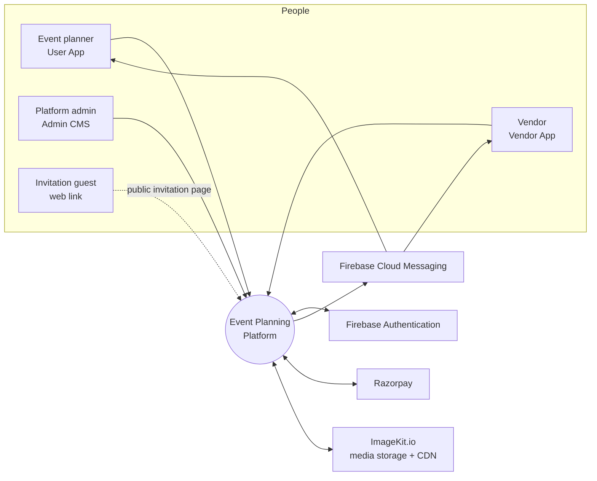
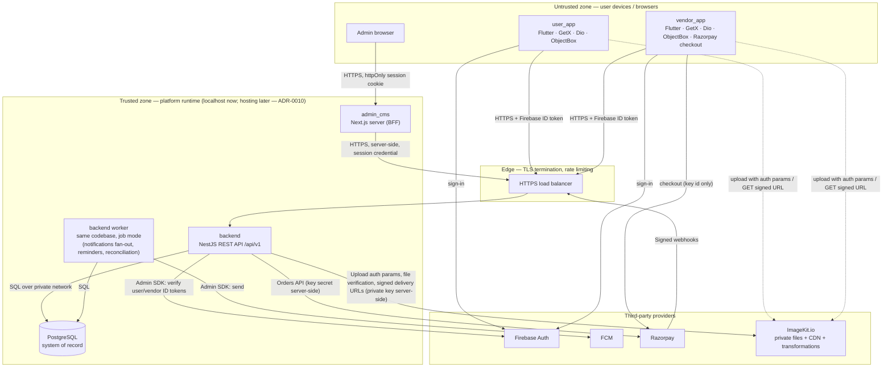

# Architecture

> Platform-wide technical architecture (M1). This is the entry point; detailed sub-documents live in `architecture/`.
> Decisions referenced as ADR-NNNN are in `decisions/`. Decisions with status **Proposed** are recommendations awaiting user ratification and must not be executed until Accepted.

| Sub-document | Covers |
|---|---|
| [architecture/backend.md](architecture/backend.md) | NestJS module map, layering, cross-cutting concerns |
| [architecture/identity-access.md](architecture/identity-access.md) | Firebase identity → backend verification → PostgreSQL user, roles, guest model, admin auth |
| [architecture/flutter.md](architecture/flutter.md) | Reference architecture for `user_app` and `vendor_app` |
| [architecture/admin-cms.md](architecture/admin-cms.md) | Next.js Admin CMS architecture |
| [architecture/media-and-deep-links.md](architecture/media-and-deep-links.md) | Media storage/upload/delivery and deep-link scheme |
| [architecture/environments.md](architecture/environments.md) | Environments, configuration and secrets matrix |
| [architecture/quality.md](architecture/quality.md) | Testing strategy, CI baseline, observability, performance budgets |
| [architecture/threat-model.md](architecture/threat-model.md) | Threat-model summary |
| [api-contracts.md](api-contracts.md) | API conventions (versioning, envelope, errors, pagination, money, idempotency, auth) |
| [database-schema.md](database-schema.md) | Data architecture conventions |
| [notification-matrix.md](notification-matrix.md) | Notification architecture + matrix |
| [payment-architecture.md](payment-architecture.md) | Platform-fee and event-payment architecture |

---

## 1. Principles

1. **Backend is authoritative.** Business rules, authorization, state transitions, payment verification and notification creation happen in NestJS. Clients render state and submit intents.
2. **PostgreSQL is the system of record.** Firebase provides identity and push delivery only; Razorpay provides payment processing only; ImageKit.io holds media bytes only. Their state is mirrored into PostgreSQL by the backend.
3. **Clients are independent.** `user_app`, `vendor_app` and `admin_cms` talk only to the REST API (`/api/v1`). No client reads another client's data source, and no client talks to PostgreSQL directly.
4. **One API, many audiences.** A single NestJS application exposes audience-scoped route groups (`/api/v1/...` shared + `/api/v1/vendor/...` + `/api/v1/admin/...`); the same domain services serve all audiences with different authorization policies.
5. **Vertical slices.** Each milestone builds only what its own scope needs, across layers (ADR-0002).
6. **Separate money domains.** Vendor platform fees and event/vendor payments are separate modules, tables and state machines (§22 CLAUDE.md, `payment-architecture.md`).
7. **No secrets in clients.** Mobile apps and the Admin CMS browser bundle contain only public identifiers (Firebase client config, Razorpay key id). See `architecture/environments.md`.

## 2. System context

External actors and systems:

| Actor / system | Interaction | Trust |
|---|---|---|
| User (event planner) | User App; guest browsing or signed in (Google / phone) | Untrusted client |
| Vendor | Vendor App; signed in; pays platform fees via Razorpay checkout | Untrusted client |
| Admin | Admin CMS in a browser; username + password (no Firebase); sub-role scoped | Untrusted client (privileged identity) |
| Invitation guest | Opens a shared invitation link (public, unguessable token) | Anonymous |
| Firebase Authentication | Issues ID tokens; backend verifies via Admin SDK | Trusted provider, verified cryptographically |
| FCM | Push delivery channel only | Trusted provider, delivery not guaranteed |
| Razorpay | Platform-fee orders, checkout, signatures, webhooks | Trusted provider, every callback signature-verified server-side |
| ImageKit.io | Media bytes, CDN, image/video transformations; private files delivered only via backend-signed URLs | Trusted provider; every upload re-verified by the backend |

## 3. Containers

| Container | Technology | Responsibility | Owns data? |
|---|---|---|---|
| `user_app` | Flutter, GetX, Dio, ObjectBox, encrypted prefs, cache manager, Firebase Auth/FCM SDKs, FreeRASP | Event planning UX for users; guest browsing | Local cache only (never authoritative) |
| `vendor_app` | Same stack + Razorpay Flutter checkout | Vendor profile, listings, platform fee, enquiries, quotations, bookings | Local cache only |
| `admin_cms` | Next.js (App Router), TypeScript, Tailwind, shadcn/ui | Admin workflows; server-side BFF that holds the admin session and calls the API | None (session only) |
| `backend` API | NestJS 11 (ADR-0003), TypeScript, Node.js LTS (ADR-0011) | REST API, authorization, business rules, payment verification, notification creation, media authorization, audit | Yes — via PostgreSQL |
| `backend` worker | Same NestJS codebase started in job mode | Asynchronous work driven by PostgreSQL job/outbox tables: FCM fan-out, reminders, payment reconciliation, media cleanup | Via PostgreSQL |
| PostgreSQL | Local PostgreSQL 18 now; hosted later (ADR-0010) | System of record; TypeORM migrations (ADR-0006) | Yes |
| Media storage | ImageKit.io (ADR-0007) | Media bytes, CDN, transformations | Bytes only; metadata in PostgreSQL |

**Why a worker in the same codebase:** asynchronous work (push fan-out, scheduled reminders, reconciliation) must not run inside request latency, but a second codebase/queue product is unnecessary at launch. A PostgreSQL-backed job table with `SELECT … FOR UPDATE SKIP LOCKED` (transactional outbox) gives exactly-once enqueue with the business transaction and at-least-once processing. Revisit if throughput requires a dedicated queue (decided with the hosting ADR).

## 4. Trust boundaries

| # | Boundary | Crossing rule |
|---|---|---|
| TB-1 | Device/browser → edge | TLS 1.2+ only; every protected request carries a Firebase ID token (mobile) or goes through the CMS BFF (admin). Rate limiting at edge and in API. |
| TB-2 | Admin browser → CMS server | httpOnly, Secure, SameSite=Strict session cookie; CSRF protection on mutations; no API credentials in the browser bundle. |
| TB-3 | API → PostgreSQL | Private network only; least-privilege DB role for the app (no DDL); migrations use a separate role. |
| TB-4 | Razorpay → API (webhooks) | `X-Razorpay-Signature` HMAC verified with the webhook secret before any processing; idempotent by Razorpay event id. |
| TB-5 | API ↔ Firebase | Admin SDK credentials held only server-side (local: service-account file outside the repo; hosted: secret store / keyless identity). |
| TB-6 | Clients ↔ ImageKit.io | Uploads only with single-use auth parameters minted by the API after ownership checks; all files private; reads only via backend-signed URLs; backend re-verifies every upload. |

## 5. Key data flows (summary)

| Flow | Path | Detail |
|---|---|---|
| Sign-in | App → Firebase Auth → ID token → `POST /api/v1/auth/session` → backend verifies → upsert user → role resolution | `architecture/identity-access.md` |
| Authenticated request | App → Dio auth interceptor attaches `Authorization: Bearer <ID token>` → API guard verifies (cached keys) → loads user/roles → policy check → service | `architecture/backend.md` |
| State change with notification | Service transaction: domain update + `audit_logs` row + `notifications` row(s) + outbox job → commit → worker sends FCM → device | `notification-matrix.md` |
| Platform fee | Vendor App → API creates Razorpay order (amount from DB) → checkout → API verifies signature → webhook confirms → `platform_fee_transactions` SUCCESS → submission advances | `payment-architecture.md` |
| Event payment record | User/vendor records a payment against a booking → `event_payment_transactions` | `payment-architecture.md` |
| Media upload | App → API `POST /media/uploads` (type/size/owner validated) → ImageKit upload auth params → client uploads to ImageKit → `POST /media/uploads/{id}/complete` → API verifies file via ImageKit API → READY; variants via URL transformations | `architecture/media-and-deep-links.md` |
| Admin action | Browser (admin session cookie) → CMS server action → API `/api/v1/admin/...` with `AdminSession` token → session + RBAC sub-role check → service → audit log | `architecture/admin-cms.md` |

## 6. Environments

`local` (now) → `staging` → `prod` (ADR-0012); staging and prod each have their own Firebase project, PostgreSQL database, ImageKit account/keys (non-prod vs prod) and Razorpay mode (test keys everywhere except prod). Full matrix in `architecture/environments.md` (ADR-0012).

## 7. Decisions index for this architecture

| ADR | Decision | Status |
|---|---|---|
| ADR-0003 | NestJS 11.x | Accepted |
| ADR-0004 | Single root git monorepo | Accepted |
| ADR-0006 | ORM & migrations: TypeORM + migration scripts | **Accepted** |
| ADR-0007 | Media storage: ImageKit.io (private files, backend-signed URLs) | **Accepted** |
| ADR-0008 | Identity: Firebase (Google, phone) for users/vendors; username + password for admins; roles in PostgreSQL; no 2FA at launch | **Accepted** |
| ADR-0009 | Flutter: two separate codebases, no shared package | **Accepted** |
| ADR-0010 | Hosting deferred; localhost + local PostgreSQL now | **Accepted** |
| ADR-0011 | Node.js 24 LTS + npm | **Accepted** |
| ADR-0012 | Environments: staging + prod (Firebase, ImageKit, Razorpay modes) | **Accepted** |
| ADR-0013 | Pagination: cursor by default, offset for admin tables | **Accepted** |
| ADR-0014 | Money: rupees with 2 decimals; exact decimal vs double decided in M2 | Proposed — deferred to M2 |
| ADR-0015 | Backend/database foundation lands in M3 | **Accepted** |
