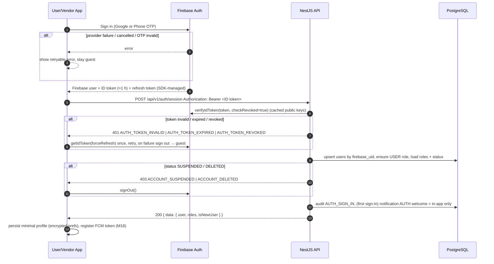
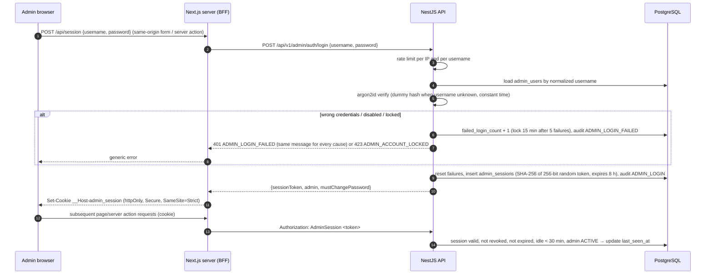

# Identity & Access Architecture

> M1 deliverable for spec item 4 / AC-4. Decision record: ADR-0008 (Accepted). Users and vendors: Firebase (Google, phone number). Admins: username + password.

## 1. Principles

- Firebase Authentication proves **who** the caller is. PostgreSQL decides **what** they are (roles, status, ownership).
- The backend never trusts client-side auth state, client-provided roles or Firebase custom claims as authorization input.
- Every protected endpoint is protected by default (global guard); public endpoints opt out explicitly with `@Public()`.

## 2. Identities and roles

| Concept | Stored in | Notes |
|---|---|---|
| Firebase identity (users and vendors) | Firebase Auth (`uid`, providers: Google, phone number) | Firebase projects: staging and prod (ADR-0012) |
| Platform user | PostgreSQL `users` (`firebase_uid` unique) | Created on first successful `/auth/session` |
| App role | PostgreSQL `user_roles` (`USER`, `VENDOR`) | A person may be both USER and VENDOR with the same identity |
| Admin account + sub-role | PostgreSQL `admin_users` (username + argon2id password hash; `role`: `SUPER_ADMIN`, `MARKETPLACE_ADMIN`, `FINANCE_ADMIN`, `SUPPORT_ADMIN`, `CONTENT_ADMIN`) | Separate from `users`; no Firebase; created only by a SUPER_ADMIN (or the bootstrap CLI); never self-service |
| Account status | `users.status` (`ACTIVE`, `SUSPENDED`, `DELETED`) — R11: deletion only marks the account | Checked on every request |

Role resolution:
- User App calls are resolved against `USER` (auto-granted on first sign-in).
- Vendor App calls under `/vendor/*` require `VENDOR`; the role is granted when the vendor onboarding record is created (M25/M26), not by the client.
- Admin calls under `/admin/*` require a valid admin session for an ACTIVE `admin_users` row; sub-role permissions in `rbac` (matrix finalized in M40).

## 3. Guest model

- Guests use the app without a Firebase user (no anonymous auth): browse categories, vendors, listings, reviews and public content via `@Public()` GET endpoints.
- Any protected action (create event, wishlist, enquiry, etc.) triggers the sign-in flow; the app resumes the intended action after sign-in (route guard stores `returnTo`).
- Public endpoints are rate-limited per IP and return only marketplace-visible (admin-approved) data.

## 4. Sign-in and session sequence (mobile)

## 5. Authenticated request and token expiry

- Dio `AuthInterceptor` obtains `FirebaseAuth.currentUser.getIdToken()` (SDK refreshes automatically when < 5 min to expiry) and sets `Authorization: Bearer`.
- On `401 AUTH_TOKEN_EXPIRED` the interceptor forces a refresh **once** (single-flight: concurrent requests wait on the same refresh) and replays the request. A second 401 → sign out, clear local user data, route to sign-in with a message.
- `verifyIdToken` with `checkRevoked` is applied on `/auth/session` and sensitive routes (payments, account changes, admin); other routes verify signature/expiry only and rely on the 1 h token lifetime plus a cached `users.status` check (cache TTL ≤ 60 s) — a balance between Firebase quota/latency and revocation speed.
- Suspension: admin action sets `users.status = SUSPENDED` **and** calls `revokeRefreshTokens(uid)`.

## 6. Account linking (Google ↔ phone)

- One platform user per Firebase `uid`. Linking is done client-side with Firebase `linkWithCredential` so both providers map to the same `uid`.
- If the second credential already belongs to another Firebase account (`credential-already-in-use`), the app does **not** merge automatically; it explains the conflict and offers sign-in with the other method. Merging two platform accounts with data is out of scope until explicitly specified (would be an admin/support process).
- Backend refreshes `users.phone` / `users.email` from verified token claims on every `/auth/session` — email only when `email_verified = true`; never from request bodies.

## 7. Admin CMS authentication (username + password — ADR-0008)

Admins do **not** use Firebase. They are a separate identity type with backend-managed credentials.

- **Accounts:** `admin_users` (`id`, `username` unique case-insensitive, `password_hash` argon2id, `display_name`, `role`, `status` ACTIVE/DISABLED, `failed_login_count`, `locked_until`, `must_change_password`, `password_changed_at`, `last_login_at`). Admins are not rows in `users` and have no Firebase identity.
- **Creation:** only a SUPER_ADMIN creates admins (temporary password, `must_change_password = true`). The first SUPER_ADMIN is created by an audited one-off CLI command with credentials entered at runtime (never committed, never seeded).
- **Passwords:** min 12 characters, checked against a common/breached-password list, max 128; argon2id with per-hash salt; no periodic forced rotation; changing the password revokes all other sessions.
- **Reset:** no email reset at launch — a SUPER_ADMIN sets a new temporary password (revokes sessions, audited); a locked-out sole SUPER_ADMIN is recovered with the CLI command.
- **Sessions:** opaque random token, stored only as a hash in `admin_sessions`; 8 h absolute, 30 min idle; sign-out revokes the session; SUPER_ADMIN can revoke any admin's sessions.
- **Step-up:** high-impact actions (platform-fee change, user suspension, admin creation/role change, refund marking) require re-entering the password if the last password confirmation is older than 15 min.
- **Separation:** `/api/v1/admin/*` accepts **only** `Authorization: AdminSession <token>`; Firebase Bearer tokens are rejected there, and admin session tokens are rejected on non-admin routes.
- **No two-factor verification at launch** (user decision 2026-10-06; accepted risk, revisit in M53/M65).
- All admin requests are audited with admin id, sub-role, request id and IP; login successes and failures are audited.

## 7a. Implementation notes (M5)

- Rate limits are checked inside the global auth guard **before** token verification (per IP; 60/min on `/auth/*` because mobile carrier NAT shares IPs). Requires `trust proxy` when hosted (GI-10).
- The app never signs a user out for temporary problems (offline, 5xx, `AUTH_PROVIDER_UNAVAILABLE`): it keeps the Firebase session and shows "Couldn't reach the server — Try again" (`ProfilePendingSession`). It signs out only for `AUTH_TOKEN_REVOKED/INVALID`, a second expired token, or `ACCOUNT_SUSPENDED/DELETED`.
- Sign-out revokes refresh tokens on **all devices** — confirmed by the user 2026-10-07 (current ID tokens stay valid ≤ 1 h on routes without revocation checks).
- No profile data is stored on the device (GI-12).

## 8. Failure paths summary

| Situation | API response | Client behaviour |
|---|---|---|
| Missing token on protected route | 401 `AUTH_REQUIRED` | Route to sign-in, keep `returnTo` |
| Expired token | 401 `AUTH_TOKEN_EXPIRED` | Single forced refresh + replay |
| Invalid / revoked token | 401 `AUTH_TOKEN_INVALID` / `AUTH_TOKEN_REVOKED` | Sign out, message |
| Suspended / deleted account | 403 `ACCOUNT_SUSPENDED` / `ACCOUNT_DELETED` | Sign out, explain, support link |
| Role missing (e.g. not a vendor) | 403 `FORBIDDEN_ROLE` | Show onboarding / access message |
| Resource not owned | 404 `NOT_FOUND` (do not leak existence) | Not-found state |
| Firebase unavailable during verification | 503 `AUTH_PROVIDER_UNAVAILABLE` | Retryable error |
| Admin wrong credentials / locked | 401 `ADMIN_LOGIN_FAILED` / 423 `ADMIN_ACCOUNT_LOCKED` | Generic message; retry after lock period |
| Admin session expired / revoked | 401 `ADMIN_SESSION_EXPIRED` | Redirect to admin sign-in |
