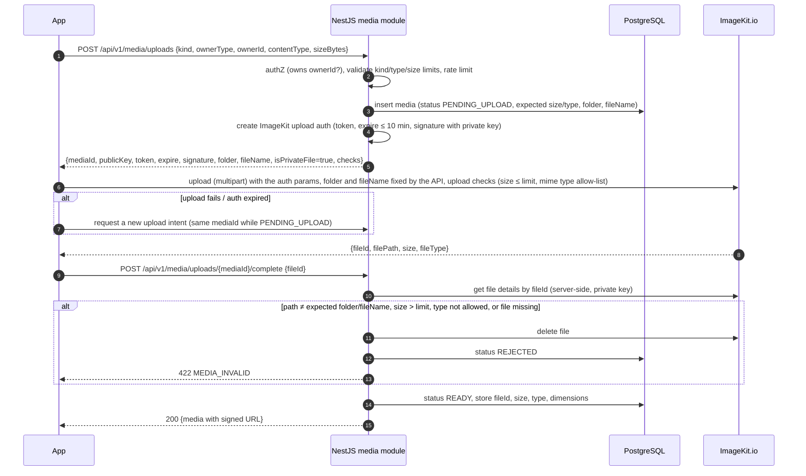

# Media and Deep-Link Architecture

> M1 deliverable for spec item 8 (media, deep linking). Storage provider: ImageKit.io — ADR-0007 (Accepted, user decision 2026-10-06).

## 1. Media categories

| Kind | Owner | Visibility | Max size | Allowed types |
|---|---|---|---|---|
| Profile photo | user / vendor | private (signed URL) | 5 MB | JPEG, PNG, WebP, HEIC |
| Vendor/listing image | vendor | public **after listing approval**; private before | 30 MB | JPEG, PNG, WebP, HEIC |
| Vendor/listing video | vendor | same as above | 30 MB | MP4 (H.264/HEVC), MOV |
| Category icon/banner | admin | public | 5 MB | PNG, WebP |
| Event cover / event media | user | private | **5 MB** (M10 user decision) | JPEG, PNG, WebP, HEIC/HEIF |
| Invitation assets (generated) | user | unlisted (unguessable token) | 10 MB | PNG, PDF |
| CMS content media | admin | public | 10 MB | JPEG, PNG, WebP |

30 MB vendor limit comes from CLAUDE.md §23; other limits are proposals and live in backend config.

## 2. Provider and file organisation (ImageKit.io — ADR-0007)

- Media bytes are stored and delivered by **ImageKit.io** (storage + CDN + URL-based image/video transformations). PostgreSQL `media` rows hold the metadata (ImageKit `fileId`, path, size, type, owner, status, visibility).
- **Every file is uploaded as an ImageKit _private file_** (`isPrivateFile: true`). Private files are delivered only through **signed URLs** generated by the backend with the ImageKit private key; there are no public, unsigned media URLs.
- Visibility is decided by the backend at read time: public entities (approved listings, published categories) get signed URLs with a long TTL (24 h); private entities (profile photos, event media, unapproved listings) get short TTL signed URLs (15 min) and only after an ownership/visibility check.
- Folder scheme: `/{env}/{kind}/{ownerType}/{ownerId}/{mediaId}.{ext}` — no user-provided names in paths. Non-production and production use **separate ImageKit accounts** (or at minimum separate environments/keys), so test uploads never live next to production data.
- Data-residency: choose the India region for the production ImageKit account if offered by the plan (user to confirm when creating the account).

## 3. Upload flow

- The upload token is single-use and short-lived; the API fixes `folder`, `fileName` and `isPrivateFile`, and the backend re-checks every attribute after upload (the client's upload request is never trusted).
- ImageKit upload-time `checks` (size/mime) are used as a first filter where available; the authoritative check is the backend's file-details verification. **Implemented in M10:** ImageKit **upload API v2** — the backend issues a single-use JWT (HS256 with the private key, `kid` = public key, ≤ 10 min) that signs `fileName`, `folder`, `isPrivateFile=true`, `useUniqueFileName=false`, `overwriteFile=false` and `checks: '"file.size" <= "5mb"'`; ImageKit rejects requests whose fields differ from the token and tokens used twice (verified live 2026-10-08). The backend calls the REST API directly (no SDK dependency): `GET /v1/files/{id}/details`, `GET /v1/files?path=…&searchQuery=name="…"` (search is eventually consistent — a just-uploaded file may not appear for a few seconds), `DELETE /v1/files/{id}`; signed URLs = HMAC-SHA1(private key, path-and-query without endpoint + expiry) appended as `ik-t`/`ik-s`; delivered variants add `md-false` (no metadata).
- **M10 implementation notes:** upload intent `POST /media/uploads` (event cover), completion `POST /media/uploads/{mediaId}/complete`, attach via `PUT /events/{id}/cover`. Rejected files are deleted only when they sit at the reserved path (a wrong path may be someone else's file). Unsigned URLs of private files return 403 (verified live).
- Abandoned `PENDING_UPLOAD` rows are marked `REJECTED` (reason `ABANDONED`) by an hourly job after 24 h, and any file at their reserved path is deleted. Rejected uploads delete their file when it is at the reserved path. At most 3 unfinished uploads per event.
- No worker-side image processing: thumbnails and sizes are produced by ImageKit URL transformations. SVG uploads are not accepted from users/vendors (admin category icons use PNG/WebP).
- Malware scanning: not in launch scope; revisit in M65 (Security Audit) — noted in threat model.

## 4. Delivery

- Variants via ImageKit transformations in the signed URL: `thumb` (`w-320`, WebP/auto format, quality 70) for lists, `medium` (`w-1080`) for details, video poster frame (`ik-thumbnail.jpg`) for video cards; original only on explicit request.
- Image metadata (EXIF/GPS) is not exposed: delivered variants use `md-false` (M10) and the original file is never served.
- Signed URLs are returned in response DTOs (`url`, `expiresAt`). Clients cache images by `mediaId+variant` key (not by URL) so URL rotation does not defeat caching.
- Loss of visibility: when an entity stops being public (listing rejected, suspended, unpublished; vendor suspended; category withdrawn) the backend immediately stops issuing URLs for it; already-issued public URLs expire within their TTL (≤ 24 h), and a purge-cache request is sent to ImageKit for the affected files. If faster removal is required, the file is deleted.
- Deletion: soft-delete in DB immediately; per R11 (interim development rule) the ImageKit file is **kept** and simply no longer served (no URLs are issued for deleted media). File deletion/purge follows the final R11 policy (M21/M72).
- Delivery is from the ImageKit endpoint (or a custom media sub-domain configured in ImageKit), which is separate from the API and Admin CMS domains (cookie-less); content types are those validated at completion.

## 5. Deep linking

Scheme (domain decided at deployment — placeholder `links.<domain>`):

| Link | Opens | Auth |
|---|---|---|
| `https://links.<domain>/u/vendors/{vendorId}` | User App vendor details | Public |
| `https://links.<domain>/u/listings/{listingId}` | User App listing details | Public |
| `https://links.<domain>/u/events/{eventId}` | User App event overview | Protected (owner) |
| `https://links.<domain>/u/bookings/{bookingId}` | User App booking | Protected |
| `https://links.<domain>/v/enquiries/{enquiryId}` | Vendor App enquiry | Protected (vendor) |
| `https://links.<domain>/v/listings/{listingId}/status` | Vendor App listing status | Protected (vendor) |
| `https://links.<domain>/i/{invitationToken}` | Public invitation web page (falls back to web if app absent) | Public, unguessable token |

- Android App Links (`assetlinks.json`) + iOS Universal Links (`apple-app-site-association`) on the link domain; custom scheme (`eventplanner://`) only as a development fallback. Firebase Dynamic Links is shut down and is **not** used.
- Notification payloads carry `deepLink` (path form, e.g. `/u/bookings/0192b0b6-6c1e-7a6b-9d3a-3f1f5c2a9e10`) plus `entityType`/`entityId`; the app's `DeepLinkRouter` maps paths to routes. Unknown or unauthorized targets fall back to the notification center with a message.
- Deep-link IDs never grant access; the API authorizes each fetch.
- Invitation tokens are stored only as a SHA-256 hash; invitation pages send `Referrer-Policy: no-referrer` and are `noindex`.
