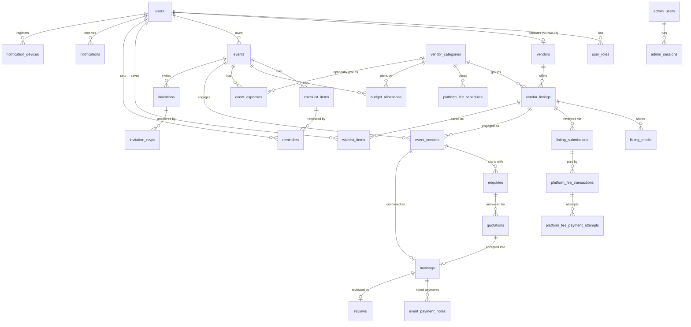

# Domain Model

> M2 deliverable (spec items 1–4, 6–7). Logical schema: `database-schema.md` Part C. Conventions: `database-schema.md` Part A. Money: ADR-0014 (exact decimal rupees).
>
> **Business-rule status (2026-10-06).** User answers received for rules 1, 2, 4, 5, 7, 8, 9, 11 and 12 (money). Rules **3 (quotations), 6 (platform fee) and 10 (vendor accounts) are ON HOLD** pending the user's client confirmation — parts that depend on them are marked **⏸ HOLD** and must not be implemented until resolved. Items marked **❓ ASSUMPTION** are Claude's working assumptions awaiting user confirmation.

## 1. Business rules (as decided)

| # | Rule | Decision | Source |
|---|---|---|---|
| R1 | Same-type vendors per event | **Allowed** (e.g. two photographers) | User |
| R2 | Events per user | **Unlimited**, concurrently | User |
| R3 | Quotations | ✅ **Resolved 2026-10-08 (M15):** one live quote per enquiry (a revision SUPERSEDES the previous); optional valid-until, expired quotes cannot be accepted (no date = valid until the event date); the vendor may WITHDRAW until accepted; accepting one vendor does not affect others (R1); rejecting keeps the enquiry open for a new quote | User |
| R4 | Outside vendors | **No outside vendors** — every event vendor and booking is a platform vendor listing | User |
| R5 | User-to-vendor payments | **User-only notes**, like checklist entries; **no confirmation** by vendor or user; the platform collects no money | User |
| R6 | Platform fee | ⏸ **HOLD** — charging basis, renewal, resubmission charging pending client confirmation | User (hold) |
| R7 | Reviews | **Star rating (1–5) + comment; the comment goes to admin moderation** before it is public | User |
| R8 | Checklist | **Users add every item themselves** — no templates | User |
| R9 | Invitations | **E-invitation per event**; user chooses **link or image** format; **invitation viewers can submit an RSVP** | User |
| R10 | Vendor accounts | ⏸ **HOLD** — categories per vendor, team members pending client confirmation | User (hold) |
| R11 | Account deletion | **Interim (development) rule:** keep everything in the database and media storage; only mark the account as deleted. **Final deletion policy to be discussed later** (user, 2026-10-06) — must be decided before the account-deletion feature is built (M21) and at the latest before release (M72) | User |
| R12 | Money | Exact decimal rupees, `numeric(12,2)`, API `"10.10"` (ADR-0014) | User |
| O1 | Event types | **Free text** — the user can enter any event type (no fixed/admin list) | User (2026-10-07, M8 spec) |
| O2 | Vendor location | ✅ City + list of service areas; the city filter matches either | Answered by the user 2026-10-08 (M12 spec) |

### Working assumptions needing confirmation (❓)

| ID | Assumption | Why it matters |
|---|---|---|
| A1 | ~~"No outside vendors" (R4) also means no manual/off-platform budget expenses.~~ **Superseded 2026-10-08 (M11, user answer 5):** users note their **own expenses** (money spent outside platform bookings) per event; they count as spent. Vendor discovery and bookings still cover platform vendors only (R4). | Budget model §7 |
| A2 | ✅ (confirmed 2026-10-08, M16) Payment notes (R5) are **private to the user** — the vendor does not see them, and they trigger no notifications. Vendor App M35 "Vendor Payment Tracking" would then show only the vendor's own view of bookings (agreed amounts), not the user's notes. | M35 scope, notifications |
| A3 | ✅ (confirmed 2026-10-08, M16) Payment notes are recorded **against a booking** (not free-floating per event). | Data model §5.12 |
| A4 | The **star rating is visible immediately**; only the **comment** waits for admin approval. A rejected comment leaves the rating public without text. | Review lifecycle §4.9 |
| A5 | Reviews are allowed only for a **completed booking**, one per booking; the user cannot edit after submission (edits would re-enter moderation); vendor replies are out of scope for now. | Review eligibility |
| A6 | ✅ (confirmed 2026-10-08, M19) RSVP is anonymous-friendly: guest enters **name (required)**, response **Attending / Not attending / Maybe**, **guest count (default 1)**, optional message; no login; one RSVP per browser/device (re-submitting updates it). No phone/email collected. | Privacy, data model §5.15 |
| A7 | ✅ (confirmed 2026-10-08, M15) A **booking is completed** automatically the day after the service date (job) unless cancelled; the user can also mark it completed earlier. Either party can **cancel** a confirmed booking with a reason. | Booking lifecycle §4.6 |
| A9 | ✅ (confirmed by the user 2026-10-08, M14 spec) **Vendor view of the user:** before a booking is CONFIRMED the vendor sees the user's display name, event type, event date, city and guest estimate only; after CONFIRMED also the user's phone number and venue name/address. Never: email, budget, payment notes, other vendors, `event_vendors.notes` (private to the user). | Privacy (security review M1) |
| A10 | ✅ **Vendor business phone/email** are shown on approved listings to **signed-in users only** (guests are asked to sign in), with tap-to-call / tap-to-email (user answer, M13 spec 2026-10-08). | Privacy |
| A11 | ✅ (confirmed 2026-10-08, M16) Budget "Paid" counts **all** of the user's payment notes (including on cancelled bookings); notes on cancelled bookings are shown separately as "paid to cancelled vendors". Notes can still be added to a cancelled booking (e.g. a refund-less advance). | Budget §7 |
| A12 | **Self-dealing ban:** a user cannot enquire with, book or review their own vendor listing; reviews only after the booking's service date. | Review integrity (security review H1) |
| A8 | Deleted accounts (R11): sign-in is blocked, the Firebase account is **disabled** (not deleted); a deleted **vendor's listings are hidden** from the marketplace; **reviews by a deleted user stay visible** with display name "Deleted user"; signing up again with the same Google account/phone is **not possible** (the disabled identity stays linked). | Data lifecycle §8, privacy |

## 2. Entity catalogue

Owner module = backend module from `architecture/backend.md` §3. Vis. = who may read.

| Entity (table) | Purpose | Owner module | Visibility | Milestone |
|---|---|---|---|---|
| User (`users`) | Platform identity for clients and vendors (Firebase-backed) | `users` | Self; admins; public display name only where shown in reviews | M5 |
| UserRole (`user_roles`) | `USER` / `VENDOR` roles | `rbac` | Self; admins | M5 |
| AdminUser (`admin_users`) | Admin account, username + password, sub-role | `admin-auth` | Admins (SUPER_ADMIN manages) | M40 |
| AdminSession (`admin_sessions`) | Server-side admin sessions | `admin-auth` | Internal | M40 |
| VendorCategory (`vendor_categories`) | Admin-defined marketplace categories | `categories` | Public when PUBLISHED | M12 (seed/read), M42 (admin CRUD) |
| PlatformFeeSchedule (`platform_fee_schedules`) | Fee amount per category, versioned ⏸ R6 | `platform-fees` | Vendors (current fee), admins | M29/M43 |
| Vendor (`vendors`) | Vendor business profile (one per vendor user ⏸ R10) | `vendors` | Public (ACTIVE only), owner, admins | M12 (read), M26 |
| VendorListing (`vendor_listings`) | A vendor's offer in one category, with **starting price** | `listings` | Public when APPROVED, vendor ACTIVE and category PUBLISHED (archiving a category hides its listings — M12); owner; admins | M12 (read), M28 |
| ListingMedia (`listing_media`) | Ordered photos/videos of a listing | `listings` | As listing | M28 |
| ListingSubmission (`listing_submissions`) | One review cycle of a listing (fee → review → decision) ⏸ R6 | `listings` | Owner, admins | M30 |
| PlatformFeeTransaction (`platform_fee_transactions`) | Razorpay order-level fee payment ⏸ R6 | `platform-fees` | Owner vendor, FINANCE/SUPER admins | M29 |
| PlatformFeePaymentAttempt (`platform_fee_payment_attempts`) | Individual Razorpay payment attempts | `platform-fees` | Finance admins | M29 |
| ProviderEvent (`provider_events`) | Raw Razorpay webhooks (dedupe) | `platform-fees` | Internal | M29 |
| Event (`events`) | The user's planned event — central entity | `events` | Owner; admins | M8 |
| ChecklistItem (`checklist_items`) | User-created checklist task (R8) | `checklist` | Owner | M9 |
| BudgetAllocation (`budget_allocations`) | Planned amount per category for an event | `budget` | Owner | M11 |
| EventExpense (`event_expenses`) | The owner's own expense note for an event (title, amount > 0, date, optional category, optional note) | `budget` | Owner | M11 |
| EventVendor (`event_vendors`) | Event ↔ platform listing relationship; holds **agreed budget** | `event-vendors` | Event owner; the vendor (once enquired); admins | M14 |
| WishlistItem (`wishlist_items`) | Saved listings | `wishlist` | Owner | M14 |
| Enquiry (`enquiries`) | User's enquiry to a vendor for an event | `enquiries` | Event owner, vendor, admins | M14 |
| Quotation (`quotations`) | Vendor's price offer ⏸ R3 | `quotations` | Event owner, vendor, admins | M15 |
| Booking (`bookings`) | Confirmed engagement from an accepted quotation | `bookings` | Event owner, vendor, admins | M15 |
| EventPaymentNote (`event_payment_notes`) | User's private note of a payment made to a vendor (R5, A2, A3) | `event-payments` | Owner only; admins (support) | M16 |
| Reminder (`reminders`) | User reminder at a time, optionally for a checklist item | `reminders` | Owner | M17 |
| Invitation (`invitations`) | E-invitation for an event, link or image format (R9) | `invitations` | Owner; public via share token | M19 |
| InvitationRsvp (`invitation_rsvps`) | Guest response to an invitation (R9, A6) | `invitations` | Invitation owner; the responding device | M19 |
| Review (`reviews`) | Rating + moderated comment for a completed booking (R7) | `reviews` | Public (rating; approved comment); author; vendor; admins | M20 |
| Media (`media`) | Metadata of ImageKit files | `media` | Per owning entity | M8 |
| Notification (`notifications`) | In-app notification record | `notifications` | Recipient | M5 |
| NotificationDevice (`notification_devices`) | FCM device tokens | `notifications` | Internal | M18 |
| NotificationPreference (`notification_preferences`) | Push on/off per category | `notifications` | Self | M18 |
| ContentItem (`content_items`) | CMS content: banners, FAQs, terms (catalogue level) | `content` | Public when published | M51 |
| AuditLog (`audit_logs`) | Append-only audit trail | `audit` | Admins (SUPER/SUPPORT) | M5 |
| Job (`jobs`) | Transactional outbox / job queue | `jobs` | Internal | M5 |
| IdempotencyKey (`idempotency_keys`) | Idempotent request replay | `common` | Internal | M15 |

`Admin` (CLAUDE.md §8) = AdminUser. `PaymentTransaction` (CLAUDE.md §8) = EventPaymentNote — renamed because it is a user note, not a transaction (R5).

## 3. Relationships (ERD)

Cardinalities and FK delete behaviour (R11: **nothing is hard-deleted by the application**, so all FKs are `ON DELETE RESTRICT`; soft-delete flags are used instead):

| Relation | Cardinality | Notes |
|---|---|---|
| users → vendors | 1 : 0..1 | A user may operate at most one vendor business ⏸ R10 may change this |
| vendors → vendor_listings | 1 : 0..n | One listing per category per vendor (`uq` on vendor+category) ⏸ R10 |
| events → event_vendors | 1 : 0..n | Several in the same category allowed (R1); `uq(event_id, listing_id)` — the same listing cannot be added twice to one event |
| event_vendors → enquiries | 1 : 0..n | Normally one; a new enquiry is allowed after a previous one was closed |
| enquiries → quotations | 1 : 0..n | ⏸ R3 decides how many can be active |
| event_vendors → bookings | 1 : 0..1 active | Partial unique index on `event_vendor_id where status in ('CONFIRMED','COMPLETED')` |
| bookings → reviews | 1 : 0..1 | Unique `booking_id` (A5) |
| invitations → invitation_rsvps | 1 : 0..n | Unique `(invitation_id, responder_token_hash)` (A6) |

## 4. State machines

Notation: `FROM → TO` (actor) ⇒ side effects. Every transition writes an `audit_logs` row; notification rows refer to `notification-matrix.md` Part B. Transitions not listed are **forbidden** (`409 INVALID_STATE_TRANSITION`).

### 4.1 User account (`users.status`)
- `ACTIVE → SUSPENDED` (admin, reason) ⇒ revoke Firebase refresh tokens; N2.
- `SUSPENDED → ACTIVE` (admin) ⇒ N2.
- `ACTIVE | SUSPENDED → DELETED` (user self-service, or admin) ⇒ `deleted_at` set; Firebase account disabled; device tokens deactivated; vendor (if any) → DELETED; no data removed (R11, A8).
- `DELETED` is terminal for the application (restoration only by a future admin feature, not planned).

### 4.2 Vendor (`vendors.status`)
- `ACTIVE → SUSPENDED` (admin) ⇒ listings hidden from marketplace; N2.
- `SUSPENDED → ACTIVE` (admin) ⇒ listings visible again if APPROVED.
- `ACTIVE | SUSPENDED → DELETED` (with user deletion) ⇒ listings hidden; open enquiries closed; confirmed bookings stay (visible to users as "vendor no longer active").

### 4.3 Vendor category (`vendor_categories.status`)
- `DRAFT → PUBLISHED` (admin) ⇒ N3 (in-app to vendors).
- `PUBLISHED → ARCHIVED` (admin) ⇒ hidden from browse and from new listings; existing listings stay attached but hidden from marketplace; event_vendors unaffected.
- `ARCHIVED → PUBLISHED` (admin).

### 4.4 Vendor listing and submission ⏸ R6/R10 (fee step)

Listing (`vendor_listings.status`):
- `DRAFT → IN_REVIEW` (vendor submits; requires a submission that reached `PENDING_REVIEW`).
- `IN_REVIEW → APPROVED` (MARKETPLACE_ADMIN) ⇒ visible in User App; N8.
- `IN_REVIEW → REJECTED` (MARKETPLACE_ADMIN, reason) ⇒ N8.
- `REJECTED → DRAFT` (vendor edits to resubmit).
- Edits to an `APPROVED` listing never go live without review: the vendor edits a **pending revision** (stored separately) that goes through a new submission; the approved version stays public until the revision is approved. (Whether that re-review requires a fee is ⏸ R6.)
- `APPROVED → SUSPENDED` (admin, reason) ⇒ hidden; N8-variant.
- `SUSPENDED → APPROVED` (admin).
- `* → ARCHIVED` (vendor withdraws) ⇒ hidden; existing bookings unaffected.

Submission (`listing_submissions.status`): `AWAITING_FEE → PENDING_REVIEW` (on platform fee SUCCESS ⇒ N5, N6) → `APPROVED | REJECTED` (admin). `AWAITING_FEE | PENDING_REVIEW → WITHDRAWN` (vendor). ⏸ Whether a resubmission after rejection creates a new `AWAITING_FEE` submission or skips the fee depends on R6.

### 4.5 Platform fee transaction ⏸ R6 (amount/basis only)
As `payment-architecture.md` §1.3: `CREATED → PENDING → SUCCESS | EXPIRED`; `CREATED → FAILED` (system job: provider order never created); `REVIEW_REQUIRED` from any state on provider mismatch or late capture, resolved by FINANCE_ADMIN (with reason) to `SUCCESS` (advances the submission), `FAILED`, or `REFUNDED` (refund mechanism ⏸ R6); attempts tracked separately (`ATTEMPTED → CAPTURED | FAILED`). At most one `SUCCESS` per submission; no new order while any transaction of the submission is `REVIEW_REQUIRED`. The state machine is independent of R6; only *when* a fee is required and *how much* depends on R6.

### 4.6 Event (`events.status`)
- `PLANNING → COMPLETED` (owner, or automatically the day after `event_date`).
- `PLANNING → CANCELLED` (owner) ⇒ open enquiries closed; confirmed bookings are **not** auto-cancelled (the user cancels them individually, which notifies vendors).
- `COMPLETED | CANCELLED → PLANNING` (owner, e.g. date moved) — allowed while `event_date` is **today or later** in the event's time zone (M8: same-day reopening allowed).
- Soft delete (`deleted_at`) by owner: hides the event; same rules as CANCELLED for related records (R11 — nothing removed).

### 4.7 Event vendor (`event_vendors.status`)
- `ADDED` (user adds a listing to the event, e.g. from vendor details) → `ENQUIRED` (enquiry sent) → `QUOTED` (quotation received) → `BOOKED` (quotation accepted) → `COMPLETED` (booking completed).
- `ADDED | ENQUIRED | QUOTED → REMOVED` (user).
- `BOOKED → CANCELLED` (booking cancelled) — the user may enquire again (new enquiry) → `ENQUIRED`.
- **Agreed budget:** `bookings.agreed_amount` (copied from the accepted quotation, immutable per booking) is the **only authoritative value**; it never comes from the listing starting price. `event_vendors` holds no amount column — budget queries read the active booking. A re-booking after cancellation creates a new booking with its own amount. ⏸ R3 may add revision rules.

**M14 implementation notes:** a REMOVED event vendor frees the listing (partial unique index), so it can be added again as a new row; closing the live enquiry by the user returns the event vendor to ADDED; deleting (as well as cancelling) an event closes its live enquiries (SYSTEM).

### 4.8 Enquiry (`enquiries.status`)
- `OPEN → QUOTED` (vendor sends a quotation) ⇒ N10.
- `OPEN | QUOTED → CLOSED` (user or vendor, or automatically when a booking is confirmed / event cancelled / vendor deleted).
- `OPEN → DECLINED` (vendor, optional reason) ⇒ N11-variant to user.
- Created `OPEN` (user) ⇒ N9 to vendor.

### 4.9 Quotation — R3 (resolved M15)
- Created `SENT` (vendor) ⇒ N10 to the user; enquiry → QUOTED, event vendor → QUOTED. At most **one SENT quote per enquiry**: a revision (`revision_no + 1`) moves the previous one to `SUPERSEDED`.
- `SENT → ACCEPTED` (user, not expired) ⇒ creates the booking (§4.10) in the same transaction, enquiry CLOSED (SYSTEM), N11 to the vendor.
- `SENT → REJECTED` (user) ⇒ N11; enquiry back to OPEN and event vendor back to ENQUIRED so the vendor can send a new quote.
- `SENT → WITHDRAWN` (vendor, until accepted) ⇒ N11-variant to the user (M33).
- **EXPIRED** is derived, not stored: a SENT quote whose `valid_until` (or, without one, the event date) is before today in the event's time zone is shown as EXPIRED and cannot be accepted.

### 4.10 Booking (`bookings.status`) — A7
- Created `CONFIRMED` atomically with quotation acceptance (idempotent) ⇒ N12 to both.
- `CONFIRMED → CANCELLED` (user or vendor, reason required; SUPPORT_ADMIN or SUPER_ADMIN with reason and password step-up) ⇒ N13.
- `CONFIRMED → COMPLETED` (system the day after `service_date`, or user on/after `service_date`) ⇒ N14 (review prompt).
- `CANCELLED`, `COMPLETED` terminal.

### 4.11 Event payment note — R5 (no state machine)
Created / edited / soft-deleted by the event owner only. No confirmation, no status, no notifications (A2). Fields: amount, date, method, kind, note. Edits are audited.

### 4.12 Checklist item (`checklist_items.status`) — R8
- `PENDING ↔ DONE` (owner) ⇒ `completed_at` set/cleared.
- Overdue is **derived** (`status = PENDING and due_date < today` in the event's time zone), not stored.
- Due/overdue notifications N16 only if the item has a `due_date`.
- Soft delete by owner.

### 4.13 Reminder (`reminders.status`)
- `SCHEDULED → SENT` (system at `remind_at`) ⇒ N17.
- `SCHEDULED → CANCELLED` (owner, or when the linked checklist item is DONE/deleted, or event cancelled/deleted).
- `SCHEDULED → SCHEDULED` (owner reschedules).

### 4.14 Invitation (`invitations.status`) — R9
- `DRAFT → PUBLISHED` (owner generates; format `LINK` or `IMAGE`) ⇒ share token issued (stored hashed); image rendered to ImageKit for IMAGE format.
- `PUBLISHED → DRAFT` not allowed; edits to a published invitation create a new version of its content under the same token.
- `PUBLISHED → REVOKED` (owner) ⇒ public link stops working; RSVPs stay.
- `PUBLISHED`: RSVP open while `rsvp_open = true` and before the event date + 1 day.

### 4.15 Invitation RSVP — A6
Upsert per `(invitation_id, responder_token_hash)`; response `ATTENDING | NOT_ATTENDING | MAYBE`; actor type `GUEST` in audit. Abuse limits: rate limit per IP and per invitation, cap 1,000 RSVPs per invitation, guest count 1–20. ⇒ N18 as one **digest** notification row per invitation per hour (not one per RSVP). The owner can rotate the share token (old link stops) and choose whether the venue address is shown publicly.

### 4.16 Review (`reviews.comment_status`) — R7, A4, A5
- Created with rating (visible immediately, A4) and comment `PENDING_MODERATION` (if a comment was given; otherwise `NONE`) ⇒ N23 (admins) .
- `PENDING_MODERATION → APPROVED` (MARKETPLACE_ADMIN or CONTENT_ADMIN) ⇒ comment public; N19 to vendor; N24 to author.
- `PENDING_MODERATION → REJECTED` (admin, reason) ⇒ comment hidden, rating stays; N24 to author.
- `APPROVED → HIDDEN` (admin, later abuse report) ⇒ N20.
- Rating counts toward the listing average immediately (A4). Admins can also **remove a rating** (`rating_status = REMOVED`, reason) — it then leaves the average. `rating_sum`/`rating_count` are updated with atomic SQL increments in the same transaction.

## 5. Key attributes (logical)

Full column lists with constraints: `database-schema.md` Part C. Highlights:

- **events:** `owner_user_id`, `event_type` (free text, O1), `title`, `event_date` (date), `start_time` (time, nullable), `time_zone` (IANA, default `Asia/Kolkata`), `city`, `venue_name`, `venue_address`, `guest_count_estimate`, `total_budget_amount` (nullable, numeric(12,2)), `cover_media_id`, `status`, `deleted_at`.
- **vendor_listings:** `vendor_id`, `category_id`, `title`, `description`, **`starting_price_amount`** (marketplace information only), `city`, `service_areas` (text[] — O2), `status`, `rejection_reason`, `approved_at`, `approved_by_admin_id`, `version`.
- **event_vendors:** `event_id`, `listing_id`, `vendor_id` (denormalised for vendor queries), `category_id` (denormalised for budget grouping), `status`, `notes` (private to the user). No amount column.
- **bookings:** `event_vendor_id`, `quotation_id` (unique), `event_id`, `user_id`, `vendor_id`, **`agreed_amount`** (copy of accepted quotation, immutable), `service_date`, `status`, `cancelled_by_type`, `cancel_reason`, `completed_at`.
- **event_payment_notes:** `booking_id`, `event_id`, `user_id`, `kind` (`ADVANCE | INSTALMENT | FINAL | OTHER`), `amount`, `paid_on` (date), `method` (`CASH | UPI | BANK_TRANSFER | CARD | CHEQUE | OTHER`), `note`, `deleted_at`.
- **reviews:** `booking_id` (unique), `user_id`, `vendor_id`, `listing_id`, `rating` (1–5), `rating_status` (`ACTIVE | REMOVED`), `comment`, `comment_status` (`NONE | PENDING_MODERATION | APPROVED | REJECTED | HIDDEN`), `moderated_by_admin_id`, `moderated_at`, `moderation_reason`.
- **invitations:** `event_id`, `user_id`, `format` (`LINK | IMAGE`), `template_code`, `title`, `message`, `host_names`, event detail snapshot (date, time, venue), `image_media_id` (IMAGE), `share_token_hash` (unique), `status`, `rsvp_open`, `published_at`, `revoked_at`.
- **invitation_rsvps:** `invitation_id`, `responder_token_hash`, `guest_name`, `response`, `guest_count` (1–20), `message` (≤ 500 chars), `responded_at`.

## 6. Invariants (enforced by the backend)

1. A listing's **starting price** is never copied into or compared with an event's **agreed amount**; the agreed amount comes only from an accepted quotation.
2. Every event vendor references a platform listing (R4); there are no free-text vendors.
3. One active booking per event vendor; a booking requires an accepted quotation; the quotation must belong to the same event vendor.
4. Only the event owner can enquire, accept/reject quotations, record payment notes, manage checklist, budget, reminders and invitations of an event.
5. A vendor sees an event only through its own event_vendor rows, and only the fields needed (event type, date, city, guest estimate — never budget, payment notes or other vendors).
6. Payment notes exist only for the owner's own bookings; their sum never changes booking or quotation state.
7. Reviews: one per booking, only when the booking is `COMPLETED` and after its service date, only by the event owner (A5, A12). A user can never enquire with, book or review a listing whose vendor is their own vendor account (A12).
8. Marketplace visibility: listing `APPROVED` **and** vendor `ACTIVE` **and** category `PUBLISHED` **and** vendor user not `DELETED`/`SUSPENDED`.
9. Platform-fee and event-payment data never share tables, enums or modules.
10. All amounts are `numeric(12,2)` rupees, ≥ 0; currency `INR`.
11. Nothing user-generated is hard-deleted by application code (R11); deletion = `deleted_at` / `DELETED` status.
12. Invitation share tokens are random (128-bit), stored only as SHA-256 hashes; RSVP responder tokens likewise.
13. Denormalised owner columns (`event_id`, `user_id`, `vendor_id` copied onto child tables) are set server-side only and protected by **composite foreign keys** to the parent (e.g. `bookings(event_vendor_id, event_id, vendor_id) → event_vendors(id, event_id, vendor_id)`), so they cannot drift.
14. A vendor sees user data only per A9.
15. Admin **reads** of user-private data (events, payment notes, RSVPs, deleted accounts) are audited.
16. FCM device tokens move to the signed-in user on registration and are deleted/deactivated on sign-out.

## 7. Budget model (spec item 6)

Per event (all server-computed, exact decimals):

| Figure | Definition |
|---|---|
| Total budget | `events.total_budget_amount` (user-set, optional) |
| Planned by category | `budget_allocations.planned_amount` per category (optional) |
| Committed | Σ `bookings.agreed_amount` where status `CONFIRMED` or `COMPLETED` |
| Paid (user notes) | Σ `event_payment_notes.amount` (not deleted) over **all** the event's bookings (A11); the part on cancelled bookings is shown separately |
| Outstanding | Committed − Paid, per booking and in total (may be negative if the user over-recorded; shown as "overpaid") |
| Own expenses (M11) | Σ `event_expenses.amount` (not deleted), overall and per category |
| Spent | Paid + Own expenses |
| Remaining budget | Total budget − Committed − Own expenses (shown only if total budget is set; negative = over) |
| Category view | Planned vs Committed vs Paid per category (via `event_vendors.category_id`) |

Listing starting prices appear only in marketplace screens, never in budget figures. Own expenses are for spending **outside** bookings; M16 must keep payment notes on bookings separate so the same money is not counted twice (GI-32).

**Implemented in M11 (Option A):** planned amounts per vendor category (`budget_allocations`), total from `events.total_budget_amount`, unplanned = total − planned (negative when over-planned), committed/paid shown as zero until M15/M16. Starter categories seeded: Venue, Catering, Decoration, Photography, Videography, Makeup & Mehendi, Music & DJ, Invitations & Printing, Transport, Gifts & Return Gifts, Priest & Rituals, Other services. Budgets are read-only for completed/cancelled events. Own expenses (user answer 5, design A) are added in M11 with the same read-only rule; notes/diary per event is deferred (answer B2, GI-31).

## 8. Data lifecycle (spec item 7) — R11

| Entity | User/vendor deletes item | Account deleted | Retention |
|---|---|---|---|
| users / vendors | — | `status = DELETED`, `deleted_at`; Firebase disabled; data kept | Indefinite (R11) |
| events, checklist, reminders, budget allocations, payment notes, wishlist | Soft delete (`deleted_at`) | Kept as is, hidden | Indefinite |
| enquiries, quotations, bookings | Not deletable; closed/cancelled by state | Kept; counter-party sees "account deleted" | Indefinite |
| reviews | Not deletable by user (admin can hide) | Kept; author shown as "Deleted user" (A8) | Indefinite |
| invitations / RSVPs | Invitation revoke (soft) | Invitations revoked; RSVPs kept | Indefinite |
| media (ImageKit) | Soft delete in DB; **file kept** in ImageKit, no longer served | Kept, not served | Indefinite |
| platform-fee records, provider events, audit logs | Never | Kept | Indefinite |
| notifications, jobs, idempotency keys | System clean-up only (technical data): notifications 1 year, jobs 30 days after completion, idempotency keys 24 h | — | As stated |

⚠ **Compliance risk to flag:** keeping all personal data after account deletion conflicts with typical erasure expectations (India's Digital Personal Data Protection Act 2023, and Google Play / App Store account-deletion policies, which require deleting or anonymising account data on request unless a legal reason applies). This is the user's **interim development** decision (R11, 2026-10-06: "for now keep it for development purpose, later we discuss"); the final policy is an open item owned by M21 (account deletion feature) and blocking for release at M72. It is recorded as a risk in `architecture/threat-model.md` and must be reviewed before release (M72) — e.g. legal advice, or switching to anonymisation.

## 9. Open items summary

| Item | Status | Owner milestone if still open at M2 approval |
|---|---|---|
| R3 Quotations | ⏸ HOLD — client confirmation | M15 (must be resolved before M15 starts) |
| R6 Platform fee | ⏸ HOLD — client confirmation | M29 (before M28/M29) |
| R10 Vendor accounts | ⏸ HOLD — client confirmation | M26 (before vendor onboarding) |
| R11 final deletion policy | Interim rule in force for development; final policy to be discussed | M21 (before account deletion is built); M72 at the latest |
| A1–A12 | ❓ **Not confirmed at M2 approval** — working assumptions; each must be confirmed (or changed) by the user before its owner milestone starts: A1, A11 → M11; A2, A3 → M16; A4, A5, A12 → M20; A6 → M19; A7 → M15; A8 → M21; A9 → M14 (and M32); A10 → M13 | As listed |
| O1 | ✅ answered: free-text event type | M8 |
| O2 | ✅ answered: city + service areas | M12 |
