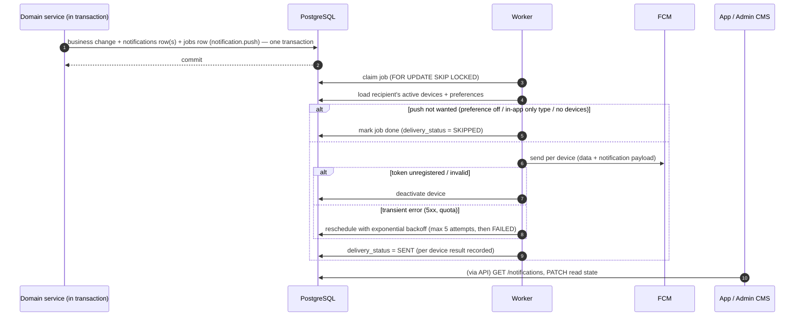

# Notification Matrix

> Part A is the notification architecture (M1, spec item 8 / AC-7). Part B is the matrix; each row is implemented and tested by the milestone that builds the triggering feature.

# Part A — Architecture

## 1. Flow



- **PostgreSQL `notifications` is the source of truth** for the in-app center. Push is best-effort delivery; failure never rolls back the business change.
- Exactly-once creation (same transaction as the change); at-least-once push (clients de-duplicate by `notificationId`).

## 2. Notification record

| Field | Notes |
|---|---|
| `id` | UUIDv7; also sent in push `data.notificationId` |
| `recipient_user_id` | Recipient platform user |
| `recipient_audience` | `USER`, `VENDOR`, `ADMIN` — which app/center shows it |
| `category` | `AUTH`, `CATEGORY`, `VENDOR`, `EVENT`, `BOOKING`, `PAYMENT`, `CHECKLIST`, `INVITATION`, `REVIEW`, `SYSTEM` |
| `type` | Stable code, e.g. `QUOTATION_RECEIVED` |
| `entity_type`, `entity_id` | Target entity |
| `title`, `body` | Rendered server-side at creation (English at launch); no sensitive data in push body |
| `deep_link` | Path form, e.g. `/u/quotations/{id}` (see `architecture/media-and-deep-links.md` §5) |
| `data jsonb` | Small extra metadata for the client |
| `read_at` | null = unread |
| `push_policy` | `ALWAYS`, `IF_ENABLED`, `NEVER` |
| `created_at` | |

Device registry `notification_devices`: `user_id`, `audience`, `fcm_token` (unique), `platform`, `app_version`, `last_seen_at`, `is_active`. Registered on sign-in/app start (M18/M36), removed on sign-out, deactivated on FCM `UNREGISTERED`.

Preferences: per user per category (push on/off); in-app records are always created. Transactional categories (`PAYMENT`, `BOOKING`, `AUTH` security events) cannot be fully disabled for in-app.

## 3. Push payload

```json
{
  "notification": { "title": "New quotation", "body": "Lens & Light sent a quotation for your wedding." },
  "data": { "notificationId": "…", "type": "QUOTATION_RECEIVED", "entityType": "QUOTATION", "entityId": "…", "deepLink": "/u/quotations/…" },
  "android": { "priority": "high", "notification": { "channelId": "bookings" } },
  "apns": { "payload": { "aps": { "thread-id": "bookings" } } }
}
```

Android channels per category group (`bookings`, `payments`, `reminders`, `marketplace`, `general`).

## 4. Admin recipients

Admin notifications are in-app (CMS) by default, addressed to all active admins holding the relevant sub-role at creation time (e.g. `MARKETPLACE_ADMIN` for listing submissions). Admin web push is not planned for launch.

## 5. Noise rules

- No push for internal/technical events (job retries, cache refresh, webhook receipt before verification).
- Collapse repeated pushes for the same entity within 2 minutes (e.g. multiple quotation edits) via FCM `collapse_key` = `type:entityId`.
- Quiet hours for non-urgent categories (reminders/marketing-like) evaluated in M17/M18.

# Part B — Matrix

In-app = row created in `notifications`. Push = FCM to recipient devices (subject to preferences).

| # | Trigger (state change) | Category | Recipient | In-App | Push | Milestone(s) |
|---|---|---|---|---|---|---|
| N1 | First sign-in (welcome) | AUTH | User | Yes | No | M5 |
| N2 | Account suspended / reinstated by admin | AUTH | User/Vendor | Yes | Yes | M46 |
| N3 | New category published | CATEGORY | Vendors | Yes | No | M42 |
| N4 | Platform fee changed for a category | CATEGORY | Vendors with drafts in that category | Yes | No | M43 |
| N5 | Vendor listing submitted for review | VENDOR | Admins (MARKETPLACE_ADMIN) | Yes | No (CMS in-app) | M30/M44 |
| N6 | Platform fee payment succeeded | PAYMENT | Vendor; Admins (FINANCE_ADMIN) | Yes | Vendor: Yes; Admin: in-app | M29 |
| N7 | Platform fee payment failed | PAYMENT | Vendor | Yes | Yes | M29 |
| N8 | Vendor listing approved / rejected (with reason) | VENDOR | Vendor | Yes | Yes | M31/M45 |
| N9 | New enquiry | BOOKING | Vendor | Yes | Yes | M14/M32 |
| N10 | Quotation received / revised | BOOKING | User | Yes | Yes | M15/M33 |
| N11 | Quotation accepted / rejected by user | BOOKING | Vendor | Yes | Yes | M15/M33 |
| N12 | Booking confirmed | BOOKING | User and Vendor | Yes | Yes | M15/M34 |
| N13 | Booking cancelled (by either party/admin) | BOOKING | Other party (and both if admin) | Yes | Yes | M15/M34/M48 |
| N14 | Booking completed | BOOKING | User (review prompt) | Yes | Yes | M15/M20 |
| N15 | Event payment recorded / status changed | PAYMENT | Other party of the booking | Yes | Yes when meaningful (SUCCESS, FAILED, REFUNDED) | M16/M35 |
| N16 | Checklist item due / overdue | CHECKLIST | User | Yes | Yes (once per item per state) | M9/M17 |
| N17 | User reminder fires | CHECKLIST | User | Yes | Yes | M17 |
| N18 | Invitation generated / shared link opened (aggregated daily) | INVITATION | User | Yes | No | M19 |
| N19 | Review received | REVIEW | Vendor | Yes | Yes | M20/M37 |
| N20 | Review hidden by moderation | REVIEW | Review author | Yes | No | M51 |
| N21 | System announcement by admin | SYSTEM | Targeted audience | Yes | Optional per announcement | M50 |
| N22 | App update required / maintenance | SYSTEM | All users of an app | Yes | Yes | M50 |

Rows are confirmed (and amended through the spec change log) by the milestone that implements them; each milestone's notification review checks every row it touches.
