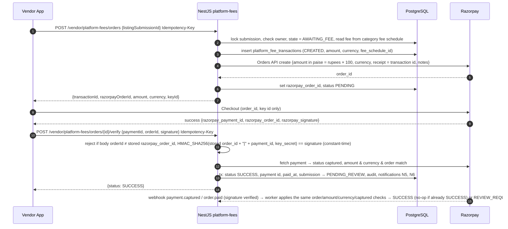

# Payment Architecture

> M1 deliverable for spec item 8 / AC-7. Detailed state machines and tables are M2; implementation is M29 (platform fee) and M16/M35 (event payments). Money representation: ADR-0014 — exact decimal rupees (`numeric(12,2)`, API `"10.10"`); the backend converts to integer paise only when calling Razorpay.

## 0. Two separate domains

| | Vendor platform fee | Event / vendor payment |
|---|---|---|
| Who pays whom | Vendor → platform | User → vendor (for an event booking) |
| Money moves through | Razorpay (platform's account) | **Never through the platform** — the user only notes payments (R5) |
| Backend module | `platform-fees` | `event-payments` |
| Table (M2) | `platform_fee_transactions` | `event_payment_notes` |
| Linked to | Vendor listing submission | Booking ↔ event-vendor relationship |
| Admin view | Finance tab "Platform fees" | Support view only (❓A2) |

The two modules never import each other, never share a table and never share a status enum (CLAUDE.md §22).

## 1. Platform fee (Razorpay)

### 1.1 Happy path

Rules:
- Amount is **always** determined by the backend from the fee schedule; the client never sends an amount.
- Payment capture: auto-capture enabled on the Razorpay account; backend still checks `captured` status.
- Fee changes apply to new orders only; each transaction stores the `fee_schedule_id` and amount used.

### 1.2 Failure, retry and idempotency

| Case | Handling |
|---|---|
| Client retries order creation | Same `Idempotency-Key` → same response; a new key while a PENDING order exists for the submission → return the existing PENDING order (one open order per submission, enforced by partial unique index) |
| Razorpay order API fails | `502 PAYMENT_PROVIDER_ERROR`; transaction stays CREATED → retried by client with same key; stale CREATED rows expired by job |
| Checkout dismissed / failed in app | Transaction stays PENDING. One Razorpay order allows several payment attempts, so `payment.failed` is recorded as a failed **attempt** (`platform_fee_payment_attempts`) and the order-level transaction stays PENDING (vendor notified N7 for the failed attempt); a later captured attempt on the same order still reaches SUCCESS. The transaction becomes `EXPIRED` only when the order expires unpaid (job, default 24 h) |
| Signature invalid | `422 VALIDATION_FAILED`; audit `PLATFORM_FEE_SIGNATURE_INVALID`; no state change; security alert metric |
| App killed after payment, before verify | Webhook (`payment.captured`/`order.paid`) completes the transaction; additionally a reconciliation job queries Razorpay for PENDING transactions older than 15 min |
| Duplicate / out-of-order webhooks | `provider_events` table keyed by Razorpay event id (dedupe); attempts are tracked per Razorpay payment id; a captured payment arriving for an `EXPIRED`/`FAILED` transaction is never ignored — it moves the transaction to `REVIEW_REQUIRED` (finance admin resolves: complete or refund) |
| Amount/currency mismatch on fetch | Mark `REVIEW_REQUIRED`, notify FINANCE_ADMIN, do not advance submission |
| Refund (admin-initiated) | Out of launch scope unless specified in M43/M49; would be `REFUNDED` via Razorpay Refunds API with webhook confirmation |

### 1.3 States (M2)

- Order-level transaction: `CREATED → PENDING` (order created at Razorpay) → `SUCCESS` (verified capture) | `EXPIRED` (order unpaid at expiry). `CREATED → FAILED` (system job when the provider order was never created).
- `REVIEW_REQUIRED` from any state on provider mismatch or a late capture on an `EXPIRED`/`FAILED` transaction. Resolved only by FINANCE_ADMIN with a reason (audited): `→ SUCCESS` (advances the submission), `→ FAILED`, or `→ REFUNDED`.
- Refund mechanism at launch is ⏸ R6 (options: manual refund in the Razorpay dashboard recorded by an admin action, or the Refunds API).
- At most one `SUCCESS` per submission (partial unique index); no new order while a transaction of the submission is `CREATED`, `PENDING` or `REVIEW_REQUIRED` (`409`).
- Attempts (`platform_fee_payment_attempts`): `ATTEMPTED → CAPTURED | FAILED`, keyed by Razorpay payment id.
- Amount: `numeric(12,2)` rupees ≥ ₹1.00; converted to integer paise at the Razorpay boundary with an assertion that the result is an integer.

### 1.4 Webhooks

- Endpoint `POST /api/v1/webhooks/razorpay` (`Auth: Public`, signature-verified on the **raw** body with the webhook secret, constant-time compare). Invalid signature → 400, logged, no processing.
- Stored raw in `provider_events` (id, type, payload, received_at, processed_at) then processed by the worker; respond 2xx quickly.
- Subscribed events: `order.paid`, `payment.captured`, `payment.failed` (+ `refund.*` if refunds are specified).

## 2. Event / vendor payments — user payment notes (R5)

The platform **does not collect any user-to-vendor money** (user decision 2026-10-06). The user may **note** payments they made to a booked vendor, like a checklist entry (R5):

- Table `event_payment_notes` (`domain-model.md` §5): `booking_id`, `kind` (`ADVANCE`, `INSTALMENT`, `FINAL`, `OTHER`), `amount` (exact decimal rupees, ADR-0014), `paid_on`, `method` (`CASH`, `UPI`, `BANK_TRANSFER`, `CARD`, `CHEQUE`, `OTHER`), `note`.
- **No confirmation, no status, no counter-party involvement**: the user creates, edits and (soft-)deletes notes; edits are audited.
- ❓ A2: notes are private to the user — vendors do not see them and no notifications are sent.
- Budget figures (`domain-model.md` §7): committed (Σ agreed amounts of active bookings) vs paid (Σ notes) → outstanding. The listing **starting price** never enters budget figures.
- Not idempotency-critical (no money moves), but creation uses the standard `Idempotency-Key` support to avoid duplicate notes on retries.
- No Razorpay, no reconciliation, no refunds.

### 2.1 Budget is planning, not payment (M11)
The event budget (`budget_allocations`, `GET /events/{id}/budget`) holds **planned** amounts only. It is neither a platform-fee nor an event-payment record: no money moves, nothing is verified, and it shares no tables or enums with either payment domain. "Paid" in the budget will be the sum of the user's own payment notes (M16); "Committed" the agreed amounts of confirmed bookings (M15).

**Own expenses (`event_expenses`, M11)** are the user's notes of money spent outside platform bookings. Like the budget they are records only — no money moves, no Razorpay, no verification — and they are kept apart from both payment domains. Spent = Paid + own expenses; Remaining = Total − Committed − own expenses. M16 payment notes belong to bookings; the UI must steer users to record a booked vendor's payment there, not as an own expense (GI-32).

## 3. Reconciliation & reporting

- Daily job driven by **Razorpay's list of captured payments** for the previous day: each is matched by `order_id` to a transaction; any capture not matched to a `SUCCESS` transaction (including late captures on old `EXPIRED` orders), or any amount/currency mismatch → `REVIEW_REQUIRED` + FINANCE_ADMIN notification. PENDING transactions older than 15 min are also polled.
- Finance reports (M49/M52) cover platform fees; event payment notes are user-private (❓A2) and appear only in aggregate, anonymised statistics if at all.

## 4. Security checklist

Key secret and webhook secret server-side only (environments.md); signature verification on both client-callback and webhook; amount from DB; idempotency keys; audit of every state change; no card data ever touches our systems (Razorpay Checkout handles it — PCI scope stays with Razorpay).
