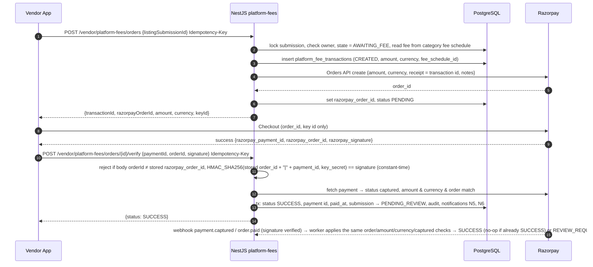

# Payment Architecture

> M1 deliverable for spec item 8 / AC-7. Detailed state machines and tables are M2; implementation is M29 (platform fee) and M16/M35 (event payments). Money representation: ADR-0014 (rupees with 2 decimals; storage type decided in M2). Amount fields below are in rupees; their exact type follows ADR-0014.

## 0. Two separate domains

| | Vendor platform fee | Event / vendor payment |
|---|---|---|
| Who pays whom | Vendor → platform | User → vendor (for an event booking) |
| Money moves through | Razorpay (platform's account) | **Not through the platform at launch** — recorded/tracked (see §2 open question) |
| Backend module | `platform-fees` | `event-payments` |
| Table (M2) | `platform_fee_transactions` | `event_payment_transactions` |
| Linked to | Vendor listing submission | Booking ↔ event-vendor relationship |
| Admin view | Finance tab "Platform fees" | Finance tab "Event payments" |

The two modules never import each other, never share a table and never share a status enum (CLAUDE.md §22).

## 1. Platform fee (Razorpay)

### 1.1 Happy path

Rules:
- Amount is **always** determined by the backend from the fee schedule; the client never sends an amount.
- Payment capture: auto-capture enabled on the Razorpay account; backend still checks `captured` status.
- Fee changes apply to new orders only; each transaction stores the `fee_schedule_id` and amount used.

### 1.2 Failure, retry and idempotency

| Case | Handling |
|---|---|
| Client retries order creation | Same `Idempotency-Key` → same response; a new key while a PENDING order exists for the submission → return the existing PENDING order (one open order per submission, enforced by partial unique index) |
| Razorpay order API fails | `502 PAYMENT_PROVIDER_ERROR`; transaction stays CREATED → retried by client with same key; stale CREATED rows expired by job |
| Checkout dismissed / failed in app | Transaction stays PENDING. One Razorpay order allows several payment attempts, so `payment.failed` is recorded as a failed **attempt** (`platform_fee_payment_attempts`) and the order-level transaction stays PENDING (vendor notified N7 for the failed attempt); a later captured attempt on the same order still reaches SUCCESS. The transaction becomes `EXPIRED` only when the order expires unpaid (job, default 24 h) |
| Signature invalid | `422 VALIDATION_FAILED`; audit `PLATFORM_FEE_SIGNATURE_INVALID`; no state change; security alert metric |
| App killed after payment, before verify | Webhook (`payment.captured`/`order.paid`) completes the transaction; additionally a reconciliation job queries Razorpay for PENDING transactions older than 15 min |
| Duplicate / out-of-order webhooks | `provider_events` table keyed by Razorpay event id (dedupe); attempts are tracked per Razorpay payment id; a captured payment arriving for an `EXPIRED`/`FAILED` transaction is never ignored — it moves the transaction to `REVIEW_REQUIRED` (finance admin resolves: complete or refund) |
| Amount/currency mismatch on fetch | Mark `REVIEW_REQUIRED`, notify FINANCE_ADMIN, do not advance submission |
| Refund (admin-initiated) | Out of launch scope unless specified in M43/M49; would be `REFUNDED` via Razorpay Refunds API with webhook confirmation |

### 1.3 States (high level; finalised in M2)

Order-level transaction: `CREATED → PENDING → SUCCESS | EXPIRED | FAILED` (`FAILED` only when the order itself cannot be paid, e.g. order creation failed permanently); `SUCCESS → REFUNDED` (if refunds are specified); `REVIEW_REQUIRED` reachable from any state when provider data disagrees or a late capture arrives, resolved by finance admin. Individual payment attempts (`ATTEMPTED → CAPTURED | FAILED`) are tracked separately. `EXPIRED`/`FAILED` are terminal for normal flow but still reconciled (§3).

### 1.4 Webhooks

- Endpoint `POST /api/v1/webhooks/razorpay` (`Auth: Public`, signature-verified on the **raw** body with the webhook secret, constant-time compare). Invalid signature → 400, logged, no processing.
- Stored raw in `provider_events` (id, type, payload, received_at, processed_at) then processed by the worker; respond 2xx quickly.
- Subscribed events: `order.paid`, `payment.captured`, `payment.failed` (+ `refund.*` if refunds are specified).

## 2. Event / vendor payments

At launch, the platform **tracks** payments between a user and a vendor for a booking; it does not collect them (no Razorpay for event payments is specified in CLAUDE.md).

- Records: `event_payment_transactions` linked to booking (and through it the event-vendor relationship): `kind` (`ADVANCE`, `INSTALMENT`, `FINAL`, `REFUND`), `amount` (rupees, ADR-0014), `currency`, `method` (`CASH`, `UPI`, `BANK_TRANSFER`, `CARD`, `OTHER`), `paid_at`, `recorded_by` (user or vendor), `reference`, `status`.
- Status (high level, M2): `RECORDED → CONFIRMED` (by the counter-party) | `DISPUTED` | `CANCELLED`; refunds are separate negative-direction records, never edits.
- Budget views compute: listing **starting price** (marketplace info only) ≠ **agreed budget** (event-vendor) ≥/≤ **sum of confirmed payments** (paid) → outstanding balance. All computed server-side.
- Idempotency key required on recording payments; edits after confirmation are not allowed (cancel + new record).

**Confirmed by the user (2026-10-06):** the platform does **not** collect any user-to-vendor money. Event payments are record-only; collecting them would require a new ADR and explicit user approval.

## 3. Reconciliation & reporting

- Daily job: compare **all** platform-fee transactions touched in the previous day (PENDING, SUCCESS, EXPIRED, FAILED) and all orders' payments with Razorpay payments/settlements; any captured payment not matched to a SUCCESS transaction, or any mismatch → `REVIEW_REQUIRED` + FINANCE_ADMIN notification.
- Finance reports (M49/M52) read both domains but present them separately.

## 4. Security checklist

Key secret and webhook secret server-side only (environments.md); signature verification on both client-callback and webhook; amount from DB; idempotency keys; audit of every state change; no card data ever touches our systems (Razorpay Checkout handles it — PCI scope stays with Razorpay).
